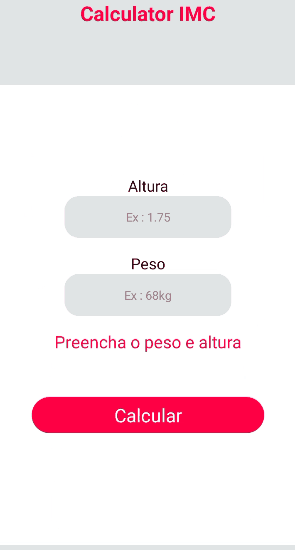
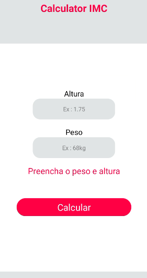
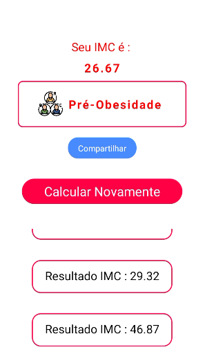

# CalculatorIMC

Uma calculadora para indice de massa corporal feita em React-Native com Expo CLI 
Criei com o objetivo de aprender as tags básicas do React-Native

</img> 
</img> 
</img> 

✅ Categoria de peso  
✅ Histórico de IMC

# 🚀 Tecnologias

- HTML
- CSS
- JavaScript
- React-Native
- Expo

